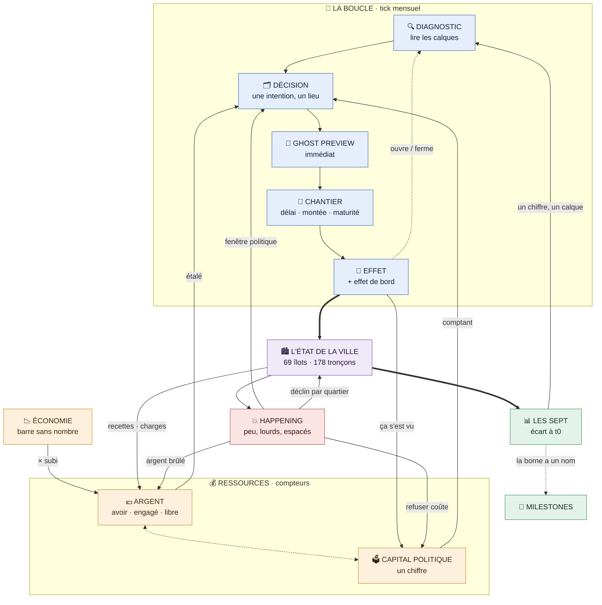
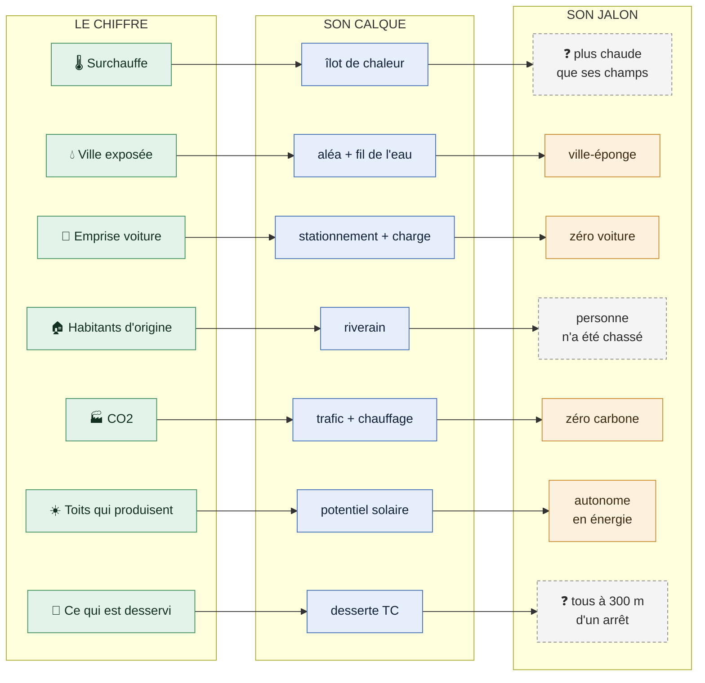
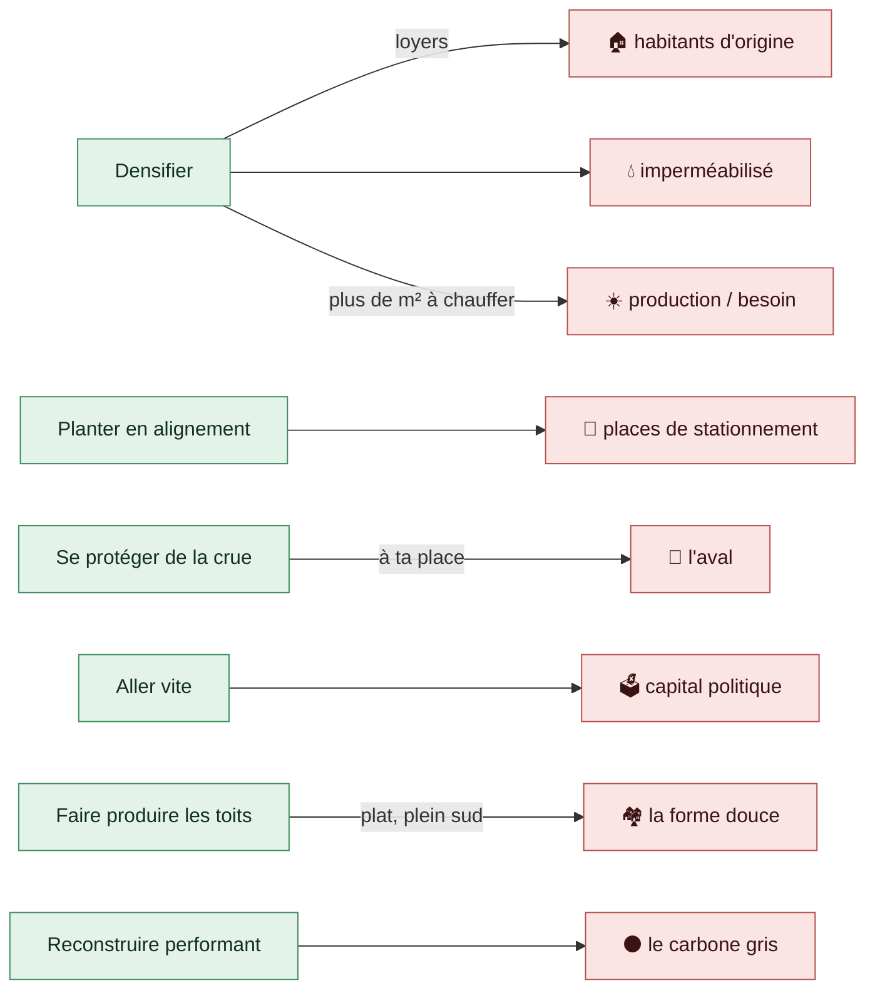

# Carte des systèmes

> **Une seule page pour tenir l'ensemble en tête.** Trois schémas : la machine, les sept, les tensions.
> Ce n'est pas une source de vérité — chaque boîte renvoie à la note qui la tranche. Si un schéma contredit une note, **c'est la note qui a raison**.

---

## 1. La machine

Ce que fait le joueur, ce que ça coûte, ce que ça déplace, et par où ça revient.

### Ce que disent les flèches courtes

| La flèche | Ce qu'elle veut dire |
|---|---|
| 💶 **étalé** vs 🗳️ **comptant** | l'argent se paie sur la durée du chantier, le capital au mois de la décision. C'est cette asymétrie qui permet de s'engager sur ce qu'on ne peut pas encore payer |
| **recettes · charges** | recettes ∝ `logements`, charges ∝ mètres de voirie — la raison structurelle de préférer la ville compacte à l'étalement |
| **× subi** | l'économie multiplie le budget, et le joueur ne la maîtrise pas. Formule cachée, jamais de difficulté adaptative. Quand la barre bouge, une phrase le dit |
| **ça s'est vu** | le capital ne s'achète pas : il se reconstitue sur un résultat **visible**. D'où le séquencement — impossible d'enchaîner trois mesures dures |
| **argent brûlé** | l'urgence achète du soulagement et zéro transformation. Refuser coûte du capital. Les deux ressources s'échangent au pire moment |
| **fenêtre politique** | la crise non évitée rend acceptable ce qui ne l'était pas. C'est comme ça que la planification marche vraiment |
| **déclin par quartier** | pas de game over. Des spirales lentes et visibles, rattrapables à très grand coût |
| **un chiffre, un calque** | c'est ce qui referme la boucle : un indicateur n'est pas une jauge, c'est la porte d'entrée d'une carte |

**Et le pivot** : rien ne se mesure sur le joueur. Recettes, indicateurs, crises — tout se lit sur **l'état de la ville**, les mêmes 69 îlots.

→ [[Boucle de jeu]] · [[Ressources]] · [[Happenings]] · [[Chantiers et temps]] · [[Déclin et défaite]]

---

## 2. Les sept — un chiffre, un calque, un jalon

La règle qui commande tout : **aucun chiffre global sans son calque.** Le chiffre dit *que* ça bouge, le calque dit *où*. Un indicateur dont on ne saurait pas dessiner la carte ne doit pas exister.

En pointillés gris : les trois jalons **non tranchés**. Les valeurs à t0 sont dans [[Indicateurs globaux]] — trois manquent encore.

**En contexte, pas en objectif** : la population, la densité, la date, et l'état de l'économie. On ne joue à faire monter aucun des quatre.

🏠 **« Habitants d'origine » part plein et ne peut que s'entamer.** Il ne se dessine pas comme les six autres : il se pose en travers, dessous, comme une ligne de prix. Tout ce qui se remplit en haut se paie là.

→ [[Indicateurs globaux]] · [[Diagnostic et calques]] · [[Milestones]]

---

## 3. Ce qui pousse contre quoi

> **Si deux indicateurs ne se poussent pas dessus, ce sont des décorations.**
> Les bornes sont la ceinture de sécurité. Le frein, ce sont ces flèches.

Deux garde-fous attachés à ce schéma :

- ⚫ **Le carbone gris rend « adapter » mécaniquement défendable face à « reconstruire »** — mais s'il pèse trop lourd, le jeu dit « ne touche à rien », ce qui contredit tout le projet. À calibrer devant les chiffres.
- 💶 **Densifier rapporte.** La contrepartie est dans la même formule (plus de logements = plus de réseau à entretenir), mais elle doit être calibrée : *une stratégie de densification pure ne doit pas s'autofinancer.*

→ [[Indicateurs globaux]] · [[Pièges connus]]

---

## Les trous de cette carte

Ce sont les endroits où le schéma dessine une flèche que le jeu ne sait pas encore montrer.

| Où | Ce qui manque |
|---|---|
| 🔴 `EFFET → CAPITAL` | **comment le capital se regagne n'a aucune forme à l'écran.** Un nombre nu ne dit pas *« ça revient parce que ça s'est vu »* — or c'est toute la mécanique de rythme → [[Ressources]] |
| ☐ `ECO → ARGENT` | la barre et le budget sont loin l'un de l'autre à l'écran : **rien ne dit au joueur que l'un commande l'autre** → [[Questions ouvertes]] n°21 |
| 🟠 le bandeau | **onze nombres permanents** (7 + capital + 3 de budget), pour un seuil défendu à six. À trancher devant une maquette → [[Direction artistique]] |
| ☐ la boucle | **le temps et les chantiers en cours n'ont pas de place dans le bandeau**, alors que c'est l'anti-spectateur → [[Chantiers et temps]] |
| ⚠️ hors carte | **[[Fins et pluralisme]]** n'apparaît pas ici, et c'est le symptôme : les trois archétypes tiennent encore sur un seul axe. Le deuxième axe manque |

**Voir aussi** : [[Boucle de jeu]] · [[Ressources]] · [[Indicateurs globaux]] · [[Décisions]] · [[Milestones]] · [[Happenings]] · [[Diagnostic et calques]]
